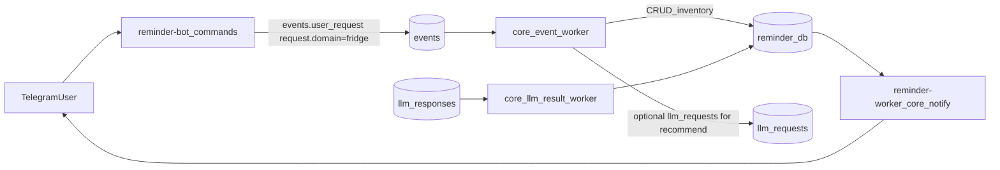

> **Audit 2026-08-21:** implemented in code/docs. YAML todos in this file may still say pending (stale). Archived to `plans/completed/`.

# Новый сценарий: Холодильник + диета + рекомендации

## Цели MVP

- Пользователь через новые команды в Telegram:
  - смотрит **что есть** в холодильнике (в т.ч. статус заморозки, остатки, даты покупки/годности, КБЖУ/100г) и **что заканчивается/просрочено**
  - **добавляет/убавляет** продукты и готовую еду (готовая еда содержит состав + порции)
  - получает **рекомендации** (завтрак/обед/ужин/день/неделя) с учётом диеты (разрешено/запрещено, цель по калориям) и опциональных пожеланий/антипожеланий
- Базово холодильник личный; но если админ вручную в БД привяжет нескольких пользователей к одному `fridge_id`, все они смогут совместно редактировать наполнение.

## Куда встраиваемся в текущую архитектуру

- **UI/команды** остаются в `reminder-bot`, но он делает только запись событий в `events`.
- **Бизнес-логика** и БД-таблицы сценария — в `core-orchestrator` (детерминированные операции + формирование LLM-промптов для рекомендаций).

## Контракт события (без ломания `request.kind`)

Используем стандартный `event_type="user_request"` (см. `[/root/core-orchestrator/EVENTS.md](/root/core-orchestrator/EVENTS.md)`), но добавляем **расширение** в `request`:

- `request.domain = "fridge"` (маршрутизация сценария)
- `request.fridge_action` — структурированное действие
- `request.auto_run = true` для CRUD (чтобы не требовать `/run`), а для рекомендаций можно оставить auto-run по умолчанию

Пример payload для списка:

- `request.kind="task"`, `request.domain="fridge"`, `request.fridge_action={"type":"inventory_list","include_expired":true,...}`

Пример payload для рекомендации:

- `request.kind="question"`, `request.domain="fridge"`, `request.fridge_action={"type":"recommend","meal":"breakfast","target_kcal":450,"preferences":{...}}`

## Данные (таблицы core-orchestrator)

Новые таблицы добавляем миграциями core (`alembic`) в `reminder_db`.

- **Каталог еды** (то, что “может существовать”):
  - `fr_foods`: `id`, `name`, `food_type` (`product|prepared`), `default_unit` (`piece|g|ml`), `kcal_per_100g`, `protein_per_100g`, `fat_per_100g`, `carbs_per_100g`, `density_g_per_ml` (optional), `created_at`
  - `fr_prepared_components`: `prepared_food_id`, `component_food_id`, `amount`, `unit`
- **Холодильники и участники**:
  - `fr_fridges`: `id`, `name`, `created_at`
  - `fr_fridge_members`: `fridge_id`, `user_id`, `role` (пока informational), unique(`fridge_id`,`user_id`)
- **Инвентарь (партии/лоты)**:
  - `fr_lots`: `id`, `fridge_id`, `food_id`, `quantity`, `unit`, `servings_total` (optional, для готовой еды), `status` (`frozen|thawed|normal`), `purchased_on`, `expires_on`, `note`, `created_at`, `updated_at`
  - Правило отображения “0.75/0.5/0.25 предмета”: для `unit=piece` разрешаем `quantity` с шагом 0.25 (валидация на уровне сервиса).
- **Аудит движений (обязательно для корректности и дебага)**:
  - `fr_movements`: `id`, `fridge_id`, `lot_id` (nullable), `food_id`, `delta_quantity`, `unit`, `reason` (`purchase|consume|cook|adjust|delete`), `task_id` (nullable), `actor_user_id`, `created_at`, `meta` (JSONB)
- **Профиль диеты пользователя**:
  - `fr_diet_profiles`: `user_id` (PK/FK), `daily_kcal_target`, `notes` (freeform), `updated_at`
  - `fr_diet_food_rules`: `id`, `user_id`, `food_id`, `rule` (`allow|deny|prefer|avoid`), unique(`user_id`,`food_id`)

Индексы: по `fr_lots(fridge_id, expires_on)`, `fr_lots(fridge_id, food_id)`, `fr_movements(fridge_id, created_at)`.

## Core-orchestrator: обработка событий и бизнес-логика

Файлы-опоры:

- `[/root/core-orchestrator/core_orchestrator/workers/event_worker.py](/root/core-orchestrator/core_orchestrator/workers/event_worker.py)`
- `[/root/core-orchestrator/core_orchestrator/workers/llm_result_worker.py](/root/core-orchestrator/core_orchestrator/workers/llm_result_worker.py)`

Изменения:

- В `event_worker` добавить роутинг: если `request.domain == "fridge"`:
  - **CRUD/list**: выполнить детерминированно (в одной транзакции), записать `TaskDetail(kind="fridge_result", content={...})` и также положить человеко-читаемый текст в `TaskDetail(kind="llm_result", content={"answer":"...", ...})`, затем перевести задачу в `DONE`.
  - **recommend**: собрать контекст (инвентарь + diet profile + пожелания) и создать `llm_request` с новым промптом `fridge_recommendation_prompt(...)`.
- В `llm_result_worker` добавить поддержку `purpose="fridge_recommendation"` (по аналогии с question envelope), чтобы:
  - распарсить JSON-envelope `{"type":"final","answer":"...","plan":...}`
  - сохранить нормализованный результат в `TaskDetail(kind="fridge_recommendation", content={...})`
  - перевести задачу в `DONE` (MVP без дополнительных review-loop, чтобы ответы приходили быстро; при желании включим review позже отдельным флагом).

## Prompts (LLM) для рекомендаций

Добавить новый промпт-шаблон в `[/root/core-orchestrator/core_orchestrator/llm_prompts.py](/root/core-orchestrator/core_orchestrator/llm_prompts.py)`:

- Вход: цель (meal/day/week), `target_kcal`, диет-правила (allow/deny/prefer/avoid), текущие лоты (qty/unit/status/expiry + kcal/100g), опциональные пожелания.
- Выход: **строго JSON-envelope**:
  - `type=final` + `answer` (человекочитаемо)
  - `suggestions` (структура для будущего автосписания): список блюд/порций с граммовками и расчётом калорий, какие лоты/продукты использовать, и что нужно докупить (missing).
  - `warnings` (просрочка/сомнительные продукты)

## reminder-bot: новые команды (UI)

Файл-опора: `[/root/reminder-bot/app/bot/handlers.py](/root/reminder-bot/app/bot/handlers.py)`

Добавляем команды, которые **пишут `events.user_request`** с `request.domain="fridge"` и `request.fridge_action={...}`:

- `/fridge` — показать содержимое (группировка: скоро истечёт / заморожено / мало осталось)
- `/fridge_add` — добавить (поддержка multi-line ввода)
- `/fridge_remove` — убрать (поддержка multi-line ввода)
- `/meal` — рекомендация (подкоманды: `breakfast|lunch|dinner|day|week`, цель по ккал, и опциональные “хочу/не хочу”)

Также обновить help-текст в `/start`.

## UX/форматирование ответа в Telegram

Файл-опора: `[/root/reminder-bot/app/worker/core_task_notify_worker.py](/root/reminder-bot/app/worker/core_task_notify_worker.py)`

- Добавить форматирование для результатов `TaskDetail(kind="fridge_result")` и/или расширить логику извлечения ответа так, чтобы для fridge-сценария корректно отправлялся “готовый текст” (и при необходимости — длинный вывод файлом).

## Проверки

- Расширить functional/E2E тесты core (см. `[/root/core-orchestrator/TESTING.md](/root/core-orchestrator/TESTING.md)`):
  - событие `request.domain=fridge` для inventory_list → создаётся task и сразу `DONE` + `fridge_result`
  - add/remove создают движения в `fr_movements` и корректно меняют `fr_lots.quantity`
  - recommend создаёт `llm_request(purpose=fridge_recommendation)` и корректно обрабатывает `llm_response` envelope

## Что ещё стоит учесть (не обязательно в 1-й итерации)

- Авто-уведомления: “скоро истекает срок”, “просрочено”, “ниже порога” (можно через reminder-worker).
- “Список покупок” (missing из рекомендаций + ручные позиции).
- Нормализация единиц (kg↔g, l↔ml) и плотность для пересчёта ml↔g.
- Поддержка нескольких партий одного продукта (уже закладываем через `fr_lots`).
- Правила списания по умолчанию: FEFO (earliest expiry first).

