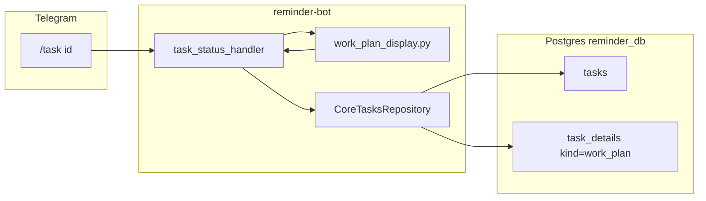

> **Audit 2026-08-21:** implemented in code/docs. YAML todos in this file may still say pending (stale). Archived to `plans/completed/`.


# Patch D: reminder-bot work plan UI

## Контекст (линия A → B → C → hardening)

| Patch | Где | Статус |
|-------|-----|--------|
| A — planner draft → `NEEDS_USER_READ` → `/run` approve | core-orchestrator | done |
| B — `allowed_actions` enforcement | core-orchestrator | done |
| C — scheduler wi-N → wi-N+1 / terminal | core-orchestrator | done |
| C hardening — idempotency, limit≠completion | core-orchestrator | done |
| **D — `/task` work plan UI** | **reminder-bot** | **этот patch** |

Сейчас [`task_status_handler`](reminder-bot/app/bot/handlers.py) (L826–859) показывает только `tasks.status`, title, LLM answer/clarify и codegen/PR — **work_plan из `task_details` не читается**.



## Scope

**In scope**
- `/task <id>`: work plan block + work_items statuses + highlight `in_progress`
- `NEEDS_USER_READ`: явный текст «план ждёт approve» + подсказки `/run` и `/ask`
- Read-only: только SELECT из `task_details`, без записи events / без изменений core
- Unit tests (pure formatting/resolution) + repo smoke + `./check.sh`
- Docs + `completed/` note

**Out of scope** (как указано)
- nested planner, parallel wi-N, GitHub webhooks
- human `NEEDS_REVIEW` PR approve (Patch E)
- изменения `core-event-worker` / state machine
- notify worker (`core_task_notify_worker`) — только `/task`, не push-уведомления

**После D** (не в этом patch): Patch E (human NEEDS_REVIEW flow) или E2E multi-wi scenario.

---

## 1. Repository: чтение work_plan rows

Файл: [`reminder-bot/app/repositories/core_tasks_repository.py`](reminder-bot/app/repositories/core_tasks_repository.py)

Добавить метод:

```python
async def get_recent_work_plan_details(self, *, task_id: int, limit: int = 30) -> list[dict]:
    # SELECT id, content FROM task_details
    # WHERE task_id=:id AND kind='work_plan'
    # ORDER BY id DESC LIMIT :limit
    # return [{"detail_id": int, "content": dict}, ...]
```

Limit **30** — не «одна последняя строка», а scan **недавних append-only snapshots** (approved progress, rejected, draft, permission-adjacent rows могут чередоваться). Зеркало core [`get_latest_approved_work_plan_detail`](core-orchestrator/core_orchestrator/work_plan_scheduler.py), но UI **не сканирует всю историю**: если за 30 записей нет подходящего snapshot — work plan block не показываем (fallback = пусто, не full-table scan).

`plans[0]` после fetch = latest row по `detail_id DESC`.

---

## 2. Pure display module (unit-testable)

**Новый файл:** [`reminder-bot/app/utils/work_plan_display.py`](reminder-bot/app/utils/work_plan_display.py)

### 2.1 Выбор plan: правило от **latest row**, не «найти latest status X»

Append-only история ломает naive «найди последний draft среди всех»:

```text
draft #1 → rejected #2
```

При `NEEDS_USER_READ` (анomaly) поиск «latest draft» показал бы устаревший #1, хотя latest row = rejected.

**Канонический алгоритм** (`resolve_work_plan_display`, pure):

```python
# plans sorted detail_id DESC; latest = plans[0]
latest = plans[0] if plans else None
latest_status = latest["content"].get("plan_status") if latest else None

if latest_status == "rejected":
    return DisplayMode.REPLAN_PENDING  # сообщение, без items

if task_status == "NEEDS_USER_READ" and latest_status == "draft":
    return DisplayMode.SHOW_PLAN(latest)  # + approve/reject CTA

if latest_status == "approved":
    return DisplayMode.SHOW_PLAN(latest)  # progress snapshot OK

# fallback (legacy / partial history within limit=30):
#   first approved in plans[], else first draft, else None
```

Примеры:

| History (newest first) | task.status | Показ |
|------------------------|-------------|-------|
| draft #3 | `NEEDS_USER_READ` | draft #3 + CTA |
| rejected #2, draft #1 | `NEEDS_USER_READ` | «План отклонён…» (не draft #1) |
| rejected #2, approved #1 | `RUNNING` | «План отклонён…» (не approved #1) |
| approved #4 (progress) | `RUNNING` | approved #4 items |

`rejected` на latest row — **основное правило**, не edge case: пользователь только что отклонил план, старый approved не показываем.

Return type: small enum/dataclass `WorkPlanDisplay` с modes `SHOW_PLAN | REPLAN_PENDING | NONE`.

Функции (pure, без DB):
- `resolve_work_plan_display(*, task_status: str, plans: list[dict]) -> WorkPlanDisplay`
- `get_in_progress_work_item(work_items) -> tuple[str | None, dict | None]` — семантика как в core
- `format_work_item_line(item, *, is_current: bool) -> str`
- `format_work_plan_section(*, task_id: int, task_status: str, display: WorkPlanDisplay) -> str`

### 2.2 Формат вывода (RU, компактно)

Заголовок включает **detail_id** для debug/MVP:

```text
План работ (draft, #183):
```

Пример `NEEDS_USER_READ` (latest row = draft):

```text
План работ (draft, #183):
Goal: Fix auth flow

Items:
  · wi-1 — Inspect repo [pending]
  · wi-2 — Apply patch [pending]

План ждёт вашего approve.
Одобрить и запустить: /run 123
Отклонить и доработать: /ask 123 <feedback>
```

Пример `RUNNING` + latest approved progress:

```text
План работ (approved, #190):
Goal: Fix auth flow

Items:
  ✓ wi-1 — Inspect repo [done]
  ▶ wi-2 — Apply patch [in_progress]
  · wi-3 — Verify tests [pending]

Current: wi-2 — Apply patch
```

Пример replan (latest row = rejected):

```text
План отклонён, ожидается новая версия…
Отправить feedback снова: /ask 123 <feedback>
```

Детали:
- `goal` если есть; items — `id`, `title` (fallback `description` ~60 chars)
- Статусы: `pending` / `in_progress` / `done`; **unknown → as-is** в `[status]` (не падать)
- Маркеры: `▶` current, `✓` done, `·` pending
- **Max 10 items** (`MAX_DISPLAY_WORK_ITEMS = 10`): если больше — показать первые 10 + `… ещё N шагов` (дешёвая защита; planner MVP ≤5 items)
- Не dumpить `allowed_actions`, `dependencies`, raw JSON

---

## 3. Handler integration

Файл: [`reminder-bot/app/bot/handlers.py`](reminder-bot/app/bot/handlers.py) — `task_status_handler`

**Инвариант:** весь `msg` собирается **до одного** вызова `_answer_text_or_file` — plan block не отправляется отдельным сообщением.

```python
msg = f"task #{task['id']} • {task['status']}\n{task['title']}"

work_plans = await repo.get_recent_work_plan_details(task_id=task_id)
display = resolve_work_plan_display(task_status=str(task["status"]), plans=work_plans)
plan_block = format_work_plan_section(task_id=task_id, task_status=..., display=display)
if plan_block:
    msg += f"\n\n{plan_block}"

# answer / clarify / codegen — append to same msg (existing logic)
if answer:
    msg += f"\n\nОтвет:\n{answer}"
elif llm_result ...:
    ...
if codegen_job:
    msg += ...

await _answer_text_or_file(message, text=msg, filename=f"task_{task_id}.txt")
```

Порядок секций: header → **work plan** → answer/clarify → codegen/PR.

`_answer_text_or_file` получает **полный** текст (plan + answer); если суммарно >4096 — один файл. Не менять порядок: plan block добавляется до answer, вызов `_answer_text_or_file` — в самом конце (как сейчас, только с plan в середине сборки).

---

## 4. Tests

### 4.1 Unit: [`reminder-bot/tests/test_work_plan_display.py`](reminder-bot/tests/test_work_plan_display.py) (новый)

| Test case | Проверка |
|-----------|----------|
| latest = draft #3 after rejected #2 + draft #1 | `NEEDS_USER_READ` → show draft #3 |
| latest = rejected, older draft exists | `NEEDS_USER_READ` → REPLAN message, **not** older draft |
| **RUNNING + latest rejected + older approved** | REPLAN message, **do not** show older approved items |
| latest = approved progress | show wi-1 done, wi-2 in_progress |
| no work_plan rows | section == `""` |
| format NEEDS_USER_READ draft | header `(draft, #id)`, CTA `/run` + `/ask` |
| format in_progress | `Current:` + `▶` marker |
| **unknown item status** (`blocked`, `paused_by_alien`) | no exception; renders `[blocked]` / `[paused_by_alien]` |
| **>10 work items** | first 10 + `… ещё N шагов` |
| question task (no plans) | `NONE`, no section |

### 4.2 Repo smoke: в [`tests/test_core_events_and_notify_worker.py`](reminder-bot/tests/test_core_events_and_notify_worker.py)

- `test_get_recent_work_plan_details_returns_ordered_rows` — insert 2–3 `work_plan` rows, assert DESC order + content

Не обязательно поднимать aiogram handler в тестах — достаточно pure + repo (паттерн репозитория уже используется в этом файле).

---

## 5. Documentation

| File | Change |
|------|--------|
| [`reminder-bot/PROJECT.md`](reminder-bot/PROJECT.md) | `/task <id>` описание: work plan + items + NEEDS_USER_READ CTA |
| [`reminder-bot/STATUS.md`](reminder-bot/STATUS.md) | Patch D implemented; снять implicit gap «бот не знает про work_plan» |
| [`reminder-bot/TESTS.md`](reminder-bot/TESTS.md) | новые test cases; note: `limit=30` = recent append-only snapshots, not full history |
| [`core-orchestrator/SCENARIOS.md`](core-orchestrator/SCENARIOS.md) §6 | `/task` теперь показывает work_plan для task flow |
| [`core-orchestrator/STATUS.md`](core-orchestrator/STATUS.md) | одна строка: Patch D UI in reminder-bot (cross-ref) |

Docs-only правки в core-orchestrator — без `completed/` там, если код core не меняется (или одна строка в reminder-bot completed note: `AffectedRepos: reminder-bot (+ core-orchestrator docs)`).

---

## 6. Completed note + verification

- [`reminder-bot/completed/2026-05-31_HHMM_work-plan-task-ui.md`](reminder-bot/completed/) — UTC timestamp, Goal/Reason/Scope/AffectedRepos/AffectedFiles
- `./check.sh` в reminder-bot (runs migrations both repos + unittest)

```bash
cd /root/reminder-bot && DATABASE_URL=postgresql+asyncpg://...reminder_db_test... ./check.sh
```

Ожидание: все существующие тесты green + новые unit/repo tests.

---

## Файлы (summary)

| Action | Path |
|--------|------|
| **NEW** | `reminder-bot/app/utils/work_plan_display.py` |
| **NEW** | `reminder-bot/tests/test_work_plan_display.py` |
| **NEW** | `reminder-bot/completed/2026-05-31_*_work-plan-task-ui.md` |
| **EDIT** | `reminder-bot/app/repositories/core_tasks_repository.py` |
| **EDIT** | `reminder-bot/app/bot/handlers.py` |
| **EDIT** | `reminder-bot/tests/test_core_events_and_notify_worker.py` |
| **EDIT** | `reminder-bot/PROJECT.md`, `STATUS.md`, `TESTS.md` |
| **EDIT** | `core-orchestrator/SCENARIOS.md` §6, `STATUS.md` (docs only) |

## Риски / mitigations

- **Stale plan при append-only history**: решено правилом «latest row first»; rejected блокирует показ older approved/draft
- **Legacy tasks** без `work_plan`: поведение `/task` как сейчас
- **Длинный msg** (plan + answer): один `_answer_text_or_file` в конце handler — весь `msg` уходит в file если >4096
- **Много items**: cap 10 + ellipsis (planner MVP ≤5)
- **History >30 rows без актуального snapshot**: не показываем plan (не full-table scan)
- **Не дублировать core scheduler logic**: только display helpers, без enqueue/advance

## Оценка feedback (incorporated)

| # | Совет | Вердикт |
|---|-------|---------|
| 2 | Latest row, не «latest draft among all» | **Принят** — core алгоритм §2.1 |
| 3 | Rejected latest = основное правило | **Принят** — не edge case |
| 4 | detail_id в заголовке | **Принят** — `(approved, #184)` |
| 5 | Max 10 items | **Принят** — дешёвая константа |
| 6 | Объяснить limit=30 | **Принят** — §1 + TESTS.md |
| 7 | Тест rejected-over-approved | **Принят** — §4.1 |
| 8 | Тест unknown statuses | **Принят** — §4.1 |
| 9 | msg assembly before `_answer_text_or_file` | **Принят** — §3 инвариант |
