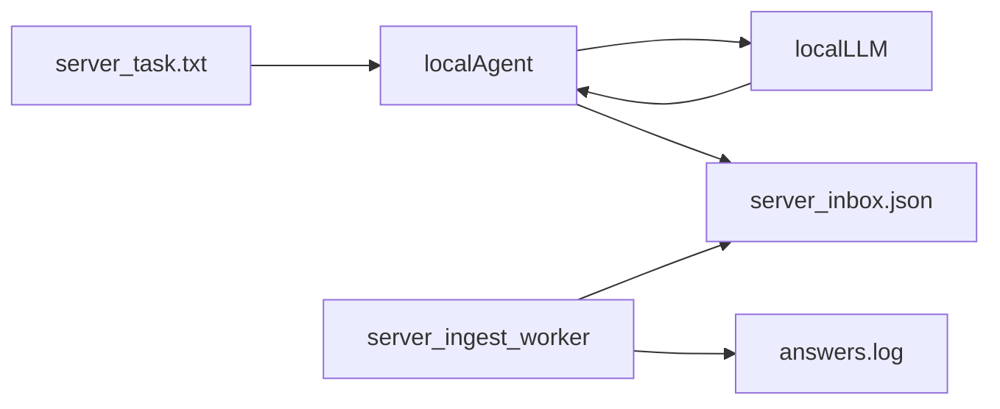

## Цель

- Задание лежит на сервере в `[/root/reminder-bot/task.txt](/root/reminder-bot/task.txt)` (сейчас: `1. 2+2`).
- Локально на вашем ПК крутится LLM (Ollama и/или LM Studio).
- Локальная машина **сама** инициирует связь (pull), получает задание, генерирует ответ, отправляет ответ на сервер.
- Сервер **сам** записывает полученный ответ в лог.

## Почему pull-схема здесь оптимальна

- Не нужно открывать доступ к вашему ПК из интернета (NAT/фаервол/порт-форвардинг).
- Достаточно 1 исходящего канала с локальной машины → сервер (обычно SSH/HTTPS).
- Проще безопасность: можно ограничить права ключа/пользователя под одну операцию.

## Ollama vs LM Studio (локальный генератор)

- **Ollama (HTTP API на `localhost:11434`)**
  - **Плюсы**: простой нативный API (`POST /api/generate` или `POST /api/chat`), удобно выключать стриминг (`stream:false`), легко выбрать модель по имени, стабильная “серверная” модель работы. Док: `[https://docs.ollama.com/api/generate](https://docs.ollama.com/api/generate)` и `[https://docs.ollama.com/api/chat](https://docs.ollama.com/api/chat)`.
  - **Минусы**: если вы хотите единый OpenAI-совместимый интерфейс под разные движки — придётся либо использовать их OpenAI-compat слой, либо держать отдельный клиент под Ollama.
- **LM Studio (локальный API-сервер)**
  - **Плюсы**: OpenAI-совместимый интерфейс (`POST /v1/chat/completions`), удобно подключать готовые клиенты/SDK, дефолтный base_url в доках: `http://localhost:1234/v1`. Док: `[https://lmstudio.ai/docs/developer/openai-compat/chat-completions](https://lmstudio.ai/docs/developer/openai-compat/chat-completions)` и запуск сервера: `[https://lmstudio.ai/docs/developer/core/server](https://lmstudio.ai/docs/developer/core/server)`.
  - **Минусы**: нужно следить, чтобы сервер запущен и модель загружена; интерфейс “как OpenAI” иногда скрывает движковые особенности (шаблоны, ограничения, параметры), а поведение может отличаться от облачного OpenAI.
- **Практический вывод**
  - Если хотите **максимально простой и предсказуемый локальный HTTP** именно под Ollama-модели — берём **Ollama**.
  - Если хотите **универсальный OpenAI-совместимый клиент**, и вам удобно работать через “chat.completions” — берём **LM Studio**.
  - В pull-агенте можно сделать **авто-фоллбек**: сначала Ollama, если недоступен — LM Studio (или наоборот).

## Предлагаемая архитектура (минимум изменений)

- **На сервере**
  - Файл задания: `[/root/reminder-bot/task.txt](/root/reminder-bot/task.txt)`.
  - “Inbox” для ответа от локального агента (новый файл/директория), например: `[/root/reminder-bot/llm_bridge/inbox.json](/root/reminder-bot/llm_bridge/inbox.json)`.
  - Отдельный простой воркер/демон (новый модуль в `app/worker/`) который:
    - каждые N секунд проверяет `inbox.json`
    - если там новый ответ — дописывает строку в лог (например `[/root/reminder-bot/llm_bridge/answers.log](/root/reminder-bot/llm_bridge/answers.log)`)
    - помечает ответ обработанным (очищает inbox или перемещает в архив)
- **На локальной машине**
  - Скрипт `llm_pull_agent`:
    - забирает `task.txt` с сервера
    - вычисляет fingerprint (хеш) чтобы не выполнять одну и ту же задачу повторно
    - вызывает локальный LLM (Ollama или LM Studio)
    - отправляет на сервер результат в `inbox.json` (с `task_hash`, `model`, `answer`, `created_at`, `latency_ms`)
    - повторяет цикл

## Что нужно проверить до реализации

- **Канал связи**: локальная машина может ходить на сервер по SSH (предпочтительно) или HTTPS.
- **Права доступа**: отдельный серверный пользователь/ключ, которому разрешено читать только `task.txt` и писать только `llm_bridge/*`.
- **Стабильность локального API**:
  - Ollama доступен на `http://localhost:11434`.
  - LM Studio Server запущен и отвечает на `http://localhost:1234/v1`.
- **Формат задачи**: сейчас `task.txt` содержит “человеческий текст”. Если позже появятся параметры (модель/температура/ограничения), стоит перейти на `task.json`.

## Где в текущем проекте логично разместить код

- Серверный воркер: `[/root/reminder-bot/app/worker/llm_ingest_worker.py](/root/reminder-bot/app/worker/llm_ingest_worker.py)` (по аналогии с `app/worker/runner.py` и `app/worker/jira_worker.py`).
- Настройки (пути/интервалы): `[/root/reminder-bot/app/config/settings.py](/root/reminder-bot/app/config/settings.py)` (добавить переменные окружения).
- Директория/файлы для обмена: `[/root/reminder-bot/llm_bridge/](/root/reminder-bot/llm_bridge/)`.

## Набор “минимально жизнеспособного” протокола

- **Task source**: текст задачи = содержимое `task.txt`.
- **Dedup**: `task_hash = sha256(task_text)`.
- **Inbox payload** (`inbox.json`):
  - `task_hash`, `task_text` (опционально), `model`, `backend` (`ollama|lmstudio`), `answer`, `error` (если упало), `created_at`, `latency_ms`.

## Test plan (после внедрения)

- Положить в `task.txt` задачу “2+2”.
- Убедиться, что локальный агент отправил `answer=4`.
- Убедиться, что серверный ingest-воркер дописал строку в `answers.log` и не дублирует запись при следующих циклах.

